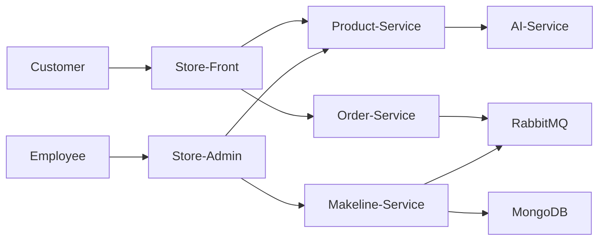

# Best Buy Cloud-Native Final Project

## Student Information

- **Name:** Ilyas Zazai
- **Student ID:** 041173490
- **Course:** Full-Stack Cloud-native Development
- **Project:** Final Project – Best Buy Cloud-Native Application

---

## Youtube Link : https://www.youtube.com/watch?v=leEt8jrVxto

---

## Project Overview

This project is a Full Stack cloud-native microservices application for Best Buy, built and deployed on **Azure Kubernetes Service (AKS)**.

The application is based on a microservices architecture and includes customer-facing, employee-facing, backend API, asynchronous processing, and database components.

### Main Services

- **Store-Front** – customer web application
- **Store-Admin** – employee web application
- **Order-Service** – handles customer orders
- **Product-Service** – handles product data
- **Makeline-Service** – background worker for order processing
- **MongoDB** – database
- **RabbitMQ** – message broker
- **AI-Service** – support service used by product-service

---

## Architecture


---

### Architecture Explanation

- Customers access the application through **Store-Front**
- Employees access the application through **Store-Admin**
- **Store-Front** communicates with **Product-Service** and **Order-Service**
- **Store-Admin** communicates with **Product-Service** and **Makeline-Service**
- **Order-Service** sends messages to **RabbitMQ**
- **Makeline-Service** reads messages from **RabbitMQ** and processes orders
- **MongoDB** stores application data
- **Product-Service** also uses **AI-Service**

---

## Kubernetes Deployment

The application is deployed to **Azure Kubernetes Service (AKS)**.

### Kubernetes Resources Used

#### Deployments
- store-front
- store-admin
- order-service
- product-service
- makeline-service
- ai-service

#### StatefulSets
- mongodb
- rabbitmq

#### Services
- LoadBalancer for store-front and store-admin
- ClusterIP for internal services

#### ConfigMap
- RabbitMQ plugin configuration

#### Secret
- Placeholder secret values for deployment

---

## AKS Configuration Used

- **Resource Group:** bestbuy-final-rg
- **Cluster Name:** bestbuy-final-aks
- **Region:** westus2
- **VM Size:** Standard_D2s_v3

---

## Deployment Instructions

### 1. Create Resource Group

```bash
az group create --name bestbuy-final-rg --location westus2
```

### 2. Create AKS Cluster

```bash
az aks create \
  --resource-group bestbuy-final-rg \
  --name bestbuy-final-aks \
  --location westus2 \
  --node-count 1 \
  --node-vm-size Standard_D2s_v3 \
  --generate-ssh-keys
```

### 3. Connect kubectl to AKS

```bash
az aks get-credentials \
  --resource-group bestbuy-final-rg \
  --name bestbuy-final-aks \
  --overwrite-existing
```

### 4. Deploy the Application

```bash
cd "Deployment Files"

kubectl apply -f config-maps.yaml
kubectl apply -f secrets.yaml
kubectl apply -f aps-all-in-one-Task1.yaml
```

### 5. Verify Deployment

```bash
kubectl get pods
kubectl get svc
kubectl get deployments
kubectl get statefulsets
```

---

## CI/CD

This project includes GitHub Actions workflows for each service.

### Implemented CI/CD Workflows

- Store-Front CI/CD
- Store-Admin CI/CD
- Order-Service CI/CD
- Product-Service CI/CD
- Makeline-Service CI/CD
- AI-Service CI/CD

### CI/CD Flow

1. Push code to GitHub
2. GitHub Actions checks out the repository
3. Docker image is built
4. Docker image is pushed to Docker Hub
5. GitHub Actions connects to AKS using kubeconfig
6. Kubernetes deployment image is updated
7. Rollout status is verified

---

## Docker Hub Images

| Service | Docker Hub Image |
|---|---|
| store-front | ilyaszazai/store-front:latest |
| store-admin | ilyaszazai/store-admin-l8:latest |
| order-service | ilyaszazai/order-service:latest |
| product-service | ilyaszazai/product-service:latest |
| makeline-service | ilyaszazai/makeline-service-l8:latest |
| ai-service | ilyaszazai/ai-service-l8:latest |

---

## Repository Links

| Service | Repository |
|---|---|
| Final Project Repo | https://github.com/Ilyzazai/bestbuy-cloud-native-final |

---

## Deployment Files

The Kubernetes deployment files are stored in the `Deployment Files/` folder.

### Main files

- aps-all-in-one-Task1.yaml
- config-maps.yaml
- secrets.yaml

---

## Current Public Access

At the time of deployment testing:

- **Store-Front:** http://20.3.61.97
- **Store-Admin:** http://172.179.179.231

These public IPs may change if the services are recreated.

---

## Notes

- MongoDB runs inside AKS as a StatefulSet
- RabbitMQ is used for asynchronous order processing
- Store-front and store-admin are public services
- Backend services are internal to the cluster
- For a production environment, secrets should not be committed with real values

---

*AI is used for Documentation*
