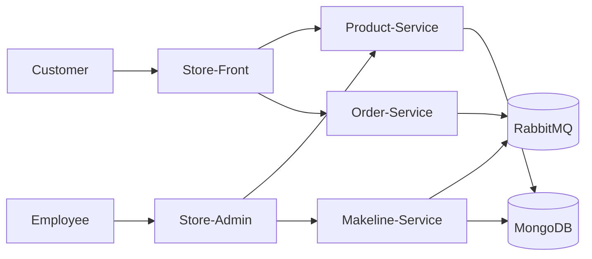

# Best Buy Cloud-Native Final Project

## Overview
This project is a cloud-native microservices application for Best Buy.  
It includes five microservices, MongoDB, Kubernetes deployment manifests, and CI/CD pipelines.

## Architecture

---
## Microservices
- Store-Front
- Store-Admin
- Order-Service
- Product-Service
- Makeline-Service

## Infrastructure
- MongoDB
- RabbitMQ
- AKS
- Docker Hub
- GitHub Actions

## Deployment Files
Kubernetes manifests are available in the `Deployment Files/` folder.

## Repository and Docker Links
| Service | Repository | Docker Image |
|--------|--------|--------|
| Store-Front | TBD | TBD |
| Store-Admin | TBD | TBD |
| Order-Service | TBD | TBD |
| Product-Service | TBD | TBD |
| Makeline-Service | TBD | TBD |

## Demo Video
YouTube link: TBD